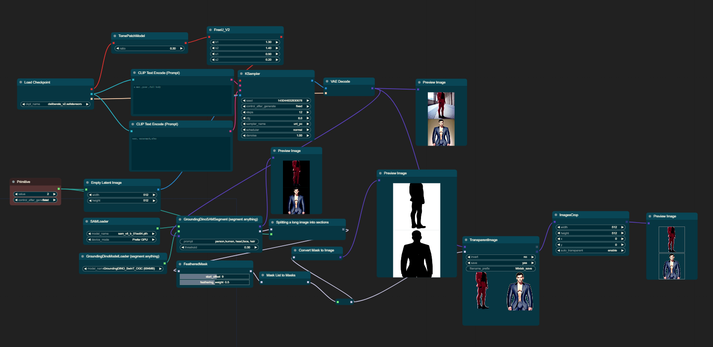

## 
In progress.
！！

### ScreenShareNode & FloatingVideoNode
> Now comfyui supports capturing screen pixel streams from any software and can be used for LCM-Lora integration. Let's get started with implementation and design! 💻🌐

https://github.com/shadowcz007/comfyui-mixlab-nodes/assets/12645064/e7e77f90-e43e-410a-ab3a-1952b7b4e7da


<!-- [ScreenShareNode](./workflow/2-screeshare.json) -->
[ScreenShareNode & FloatingVideoNode](./workflow/3-FloatVideo-workflow.json)


## Installation

For the easiest install experience, install the [Comfyui Manager](https://github.com/ltdrdata/ComfyUI-Manager) and use that to automate the installation process.
Otherwise, to manually install, simply clone the repo into the custom_nodes directory with this command:
```
git clone https://github.com/shadowcz007/comfyui-mixlab-nodes.git
```
and install the requirements using:
```
.\python_embeded\python.exe -s -m pip install -r requirements.txt
```
If you are using a venv, make sure you have it activated before installation and use:
```
pip install -r requirements.txt
```

Run directly:
```
install.bat
```

## Nodes




[workflow-1](./workflow/1-workflow.json)

> randomPrompt


> TransparentImage


> Consistency Decoder

[openai Consistency Decoder]( https://github.com/openai/consistencydecoder)


After downloading the OpenAI VAE model, place it in the "model/vae" directory for use.
https://openaipublic.azureedge.net/diff-vae/c9cebd3132dd9c42936d803e33424145a748843c8f716c0814838bdc8a2fe7cb/decoder.pt


> FeatheredMask、SmoothMask

Add edges to an image.


### Models
下载[CLIPSeg](https://huggingface.co/CIDAS/clipseg-rd64-refined/tree/main)到 model/clipseg

<!-- ### Workflow
[Workflow](./workflow.md) -->

#### Thanks:
[ComfyUI-CLIPSeg](https://github.com/biegert/ComfyUI-CLIPSeg/tree/main)


### TODO:
- vector https://github.com/GeorgLegato/stable-diffusion-webui-vectorstudio

