> 适配了最新版 comfyui 的 py3.11 ，torch 2.1.2+cu121
> [Mixlab nodes discord](https://discord.gg/cXs9vZSqeK)

#### `相关插件推荐`

<!-- [comfyui-sd-prompt-mixlab](https://github.com/shadowcz007/comfyui-sd-prompt-mixlab) -->

[comfyui-Image-reward](https://github.com/shadowcz007/comfyui-Image-reward)

[comfyui-ultralytics-yolo](https://github.com/shadowcz007/comfyui-ultralytics-yolo)

[comfyui-moondream](https://github.com/shadowcz007/comfyui-moondream)

<!-- [comfyui-CLIPSeg](https://github.com/shadowcz007/comfyui-CLIPSeg) -->

##### `最新`：

ChatGPT 节点支持 Local LLM（llama.cpp），Phi3、llama3 都可以直接一个节点运行了。

Model download,move to :`models/llamafile/`

强烈推荐：
[Phi-3-mini-4k-instruct-GGUF](https://huggingface.co/lmstudio-community/Phi-3-mini-4k-instruct-GGUF/tree/main)

[llava-phi-3-mini-gguf](https://huggingface.co/xtuner/llava-phi-3-mini-gguf/tree/main)
注意需要把llava-phi-3-mini-mmproj-f16.gguf也下载


备选：
[llama3_if_ai_sdpromptmkr_q2k](https://hf-mirror.com/impactframes/llama3_if_ai_sdpromptmkr_q2k/tree/main)


> 右键菜单支持 text-to-text，方便对 prompt 词补全
> 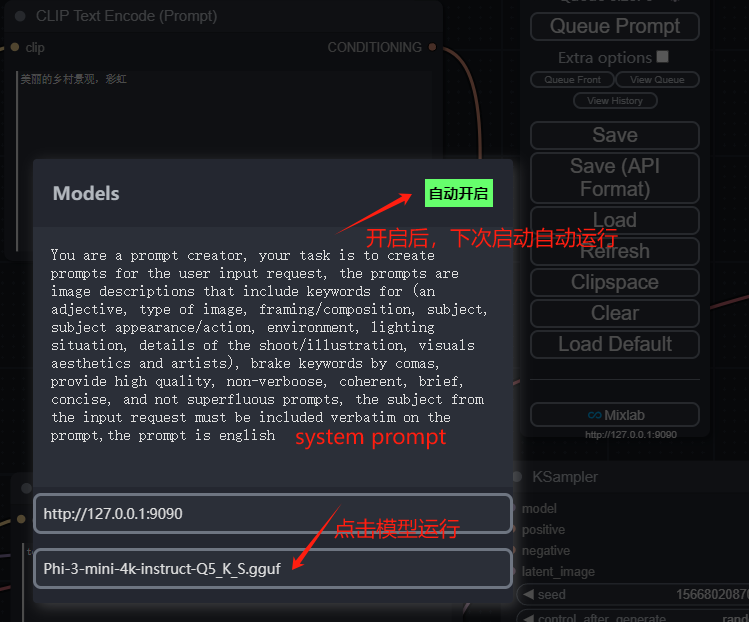
> 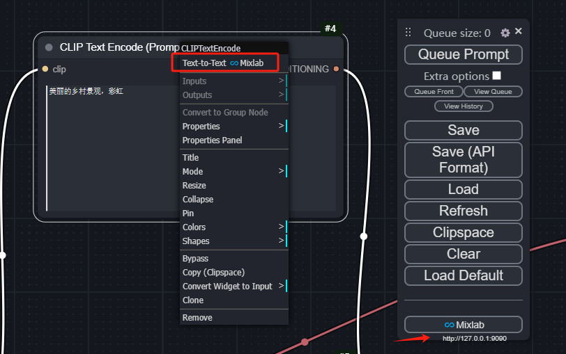

## 🚀🚗🚚🏃 Workflow-to-APP

- 新增 AppInfo 节点，可以通过简单的配置，把 workflow 转变为一个 Web APP。
- 支持多个 web app 切换
- 发布为 app 的 workflow，可以在右键里再次编辑了
- web app 可以设置分类，在 comfyui 右键菜单可以编辑更新 web app
- 支持动态提示

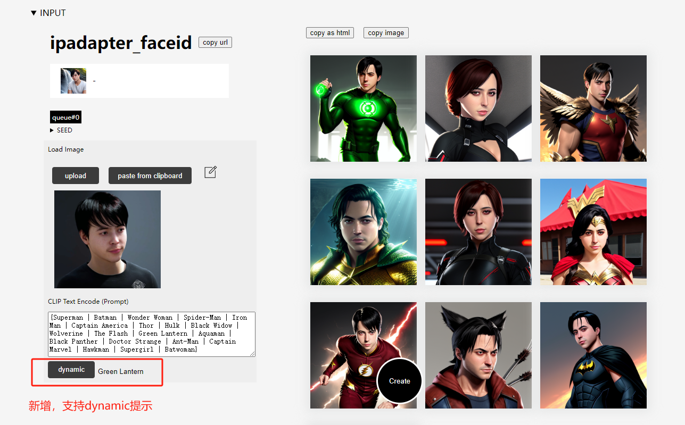

- Support multiple web app switching.
- Add the AppInfo node, which allows you to transform the workflow into a web app by simple configuration.
- The workflow, which is now released as an app, can also be edited again by right-clicking.
- The web app can be configured with categories, and the web app can be edited and updated in the right-click menu of ComfyUI.

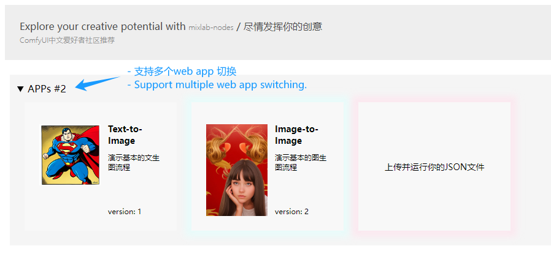

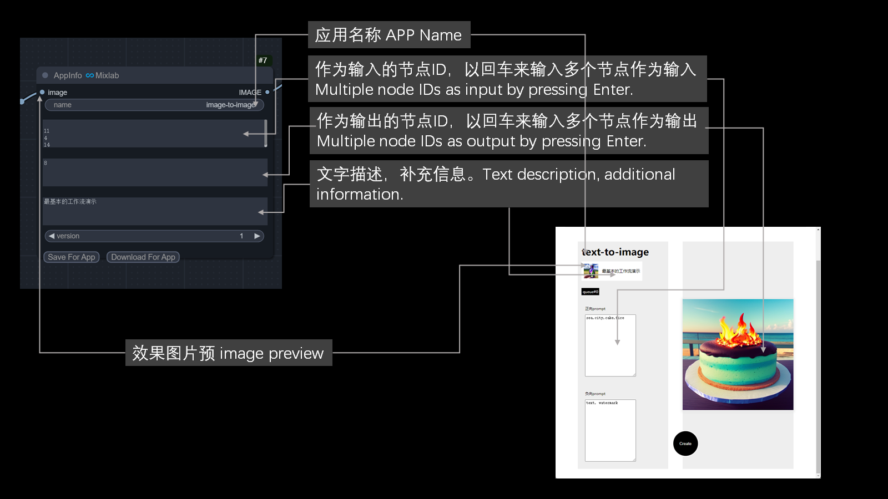

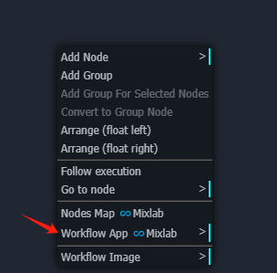

Example:

- workflow
  
  [text-to-image](./workflow/Text-to-Image-app.json)

APP-JSON:

- [text-to-image](./example/Text-to-Image_3.json)
- [image-to-image](./example/Image-to-Image_2.json)
- text-to-text

> 暂时支持 9 种节点作为界面上的输入节点：Load Image、VHS*LoadVideo、CLIPTextEncode、PromptSlide、TextInput*、Color、FloatSlider、IntNumber、CheckpointLoaderSimple、LoraLoader

> 输出节点：PreviewImage 、SaveImage、ShowTextForGPT、VHS_VideoCombine、PromptImage

> seed 统一输入控件，支持：SamplerCustom、KSampler

> 配套[ps 插件](https://github.com/shadowcz007/comfyui-ps-plugin)

> 如果遇到上传图片不成功，请检查下：局域网或者是云服务，请使用 https，端口 8189 这个服务（ 感谢 @Damien 反馈问题）

> If you encounter difficulties in uploading images, please check the following: for local network or cloud services, please use HTTPS and the service on port 8189. (Thanks to @Damien for reporting the issue.)

## 🏃🚗🚚🚀 Real-time Design

> ScreenShareNode & FloatingVideoNode. Now comfyui supports capturing screen pixel streams from any software and can be used for LCM-Lora integration. Let's get started with implementation and design! 💻🌐

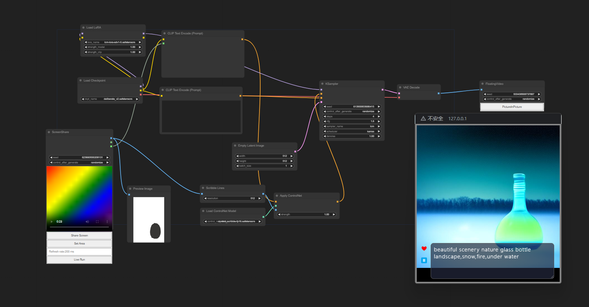

https://github.com/shadowcz007/comfyui-mixlab-nodes/assets/12645064/e7e77f90-e43e-410a-ab3a-1952b7b4e7da

<!-- [ScreenShareNode](./workflow/2-screeshare.json) -->

[ScreenShareNode & FloatingVideoNode](./workflow/3-FloatVideo-workflow.json)

!! Please use the address with HTTPS (https://127.0.0.1).

### SpeechRecognition & SpeechSynthesis

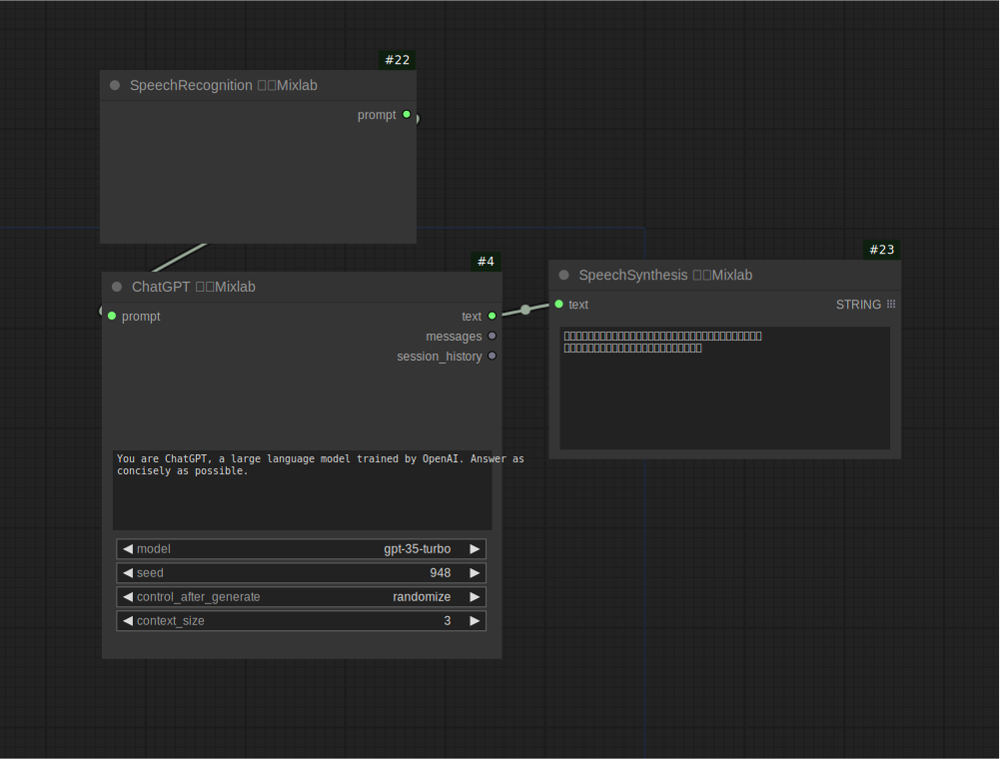

[Voice + Real-time Face Swap Workflow](./workflow/语音+实时换脸workflow.json)

### GPT

> Support for calling multiple GPTs.Local LLM（llama.cpp）、 ChatGPT、ChatGLM3 、ChatGLM4 , Some code provided by rui. If you are using OpenAI's service, fill in https://api.openai.com/v1 . If you are using a local LLM service, fill in http://127.0.0.1:xxxx/v1 . Azure OpenAI:https://xxxx.openai.azure.com

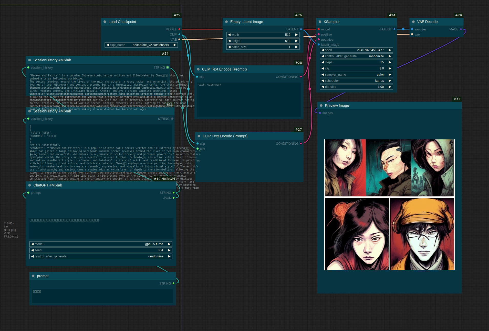

[workflow-5](./workflow/5-gpt-workflow.json)

最新：ChatGPT 节点支持 Local LLM（llama.cpp），Phi3、llama3 都可以直接一个节点运行了。

Model download,move to :`models/llamafile/`

强烈推荐：[Phi-3-mini-4k-instruct-GGUF](https://huggingface.co/lmstudio-community/Phi-3-mini-4k-instruct-GGUF/tree/main)

备选：[llama3_if_ai_sdpromptmkr_q2k](https://hf-mirror.com/impactframes/llama3_if_ai_sdpromptmkr_q2k/tree/main)

> 如果碰到安装失败，可以尝试手动安装

```
../../../python_embeded/python.exe -s -m pip install llama-cpp-python --extra-index-url https://abetlen.github.io/llama-cpp-python/whl/cu121

../../../python_embeded/python.exe -s -m pip install llama-cpp-python[server]

```

> [Mac](https://llama-cpp-python.readthedocs.io/en/latest/install/macos/)

```
pip uninstall llama-cpp-python -y
CMAKE_ARGS="-DLLAMA_METAL=on" pip install -U llama-cpp-python --no-cache-dir
pip install 'llama-cpp-python[server]'
```

```
pip install llama-cpp-python \
  --extra-index-url https://abetlen.github.io/llama-cpp-python/whl/metal
```

## Prompt

> PromptSlide
> 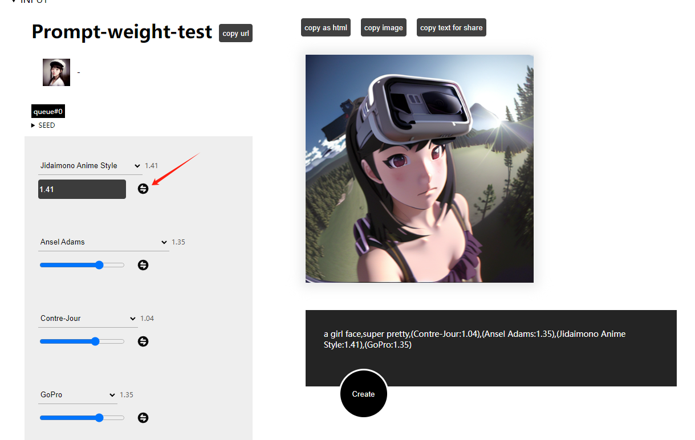

<!--  -->

> randomPrompt

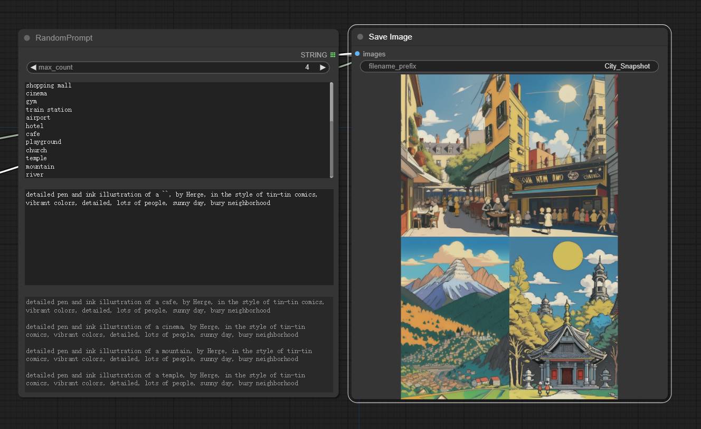

> ClipInterrogator

[add clip-interrogator](https://github.com/pharmapsychotic/clip-interrogator)

> PromptImage & PromptSimplification,Assist in simplifying prompt words, comparing images and prompt word nodes.

> ChinesePrompt && PromptGenerate，中文 prompt 节点，直接用中文书写你的 prompt


### Layers

> A new layer class node has been added, allowing you to separate the image into layers. After merging the images, you can input the controlnet for further processing.


### 3D

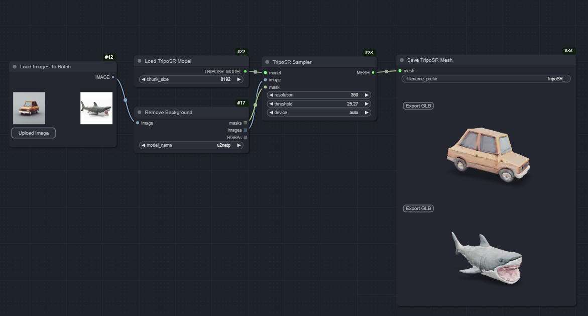
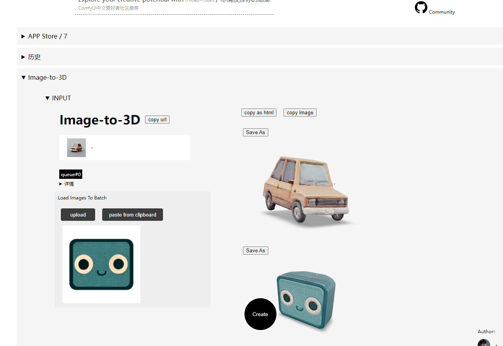
[workflow](./assets/Image-to-3D_1.json)

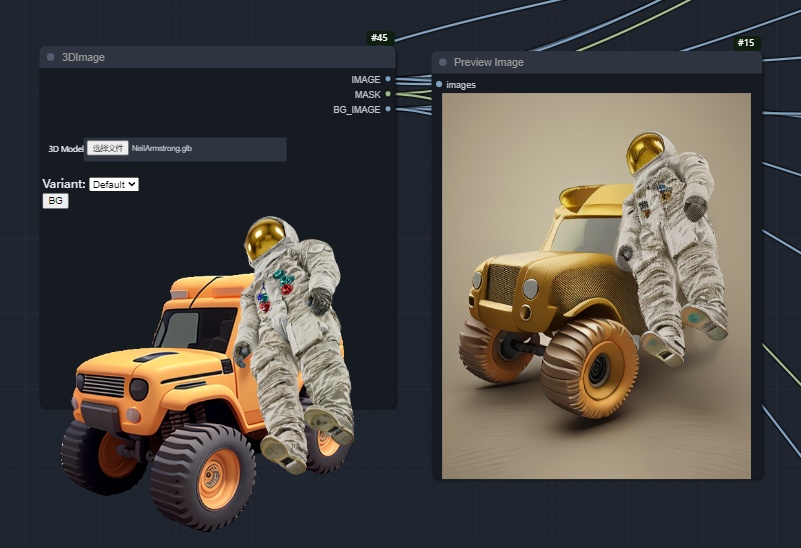
[workflow](./workflow/3D-workflow.json)

### Image

#### LoadImagesToBatch

> Upload multiple images for batch input into the IP adapter.

#### LoadImagesFromLocal

> Monitor changes to images in a local folder, and trigger real-time execution of workflows, supporting common image formats, especially PSD format, in conjunction with Photoshop.

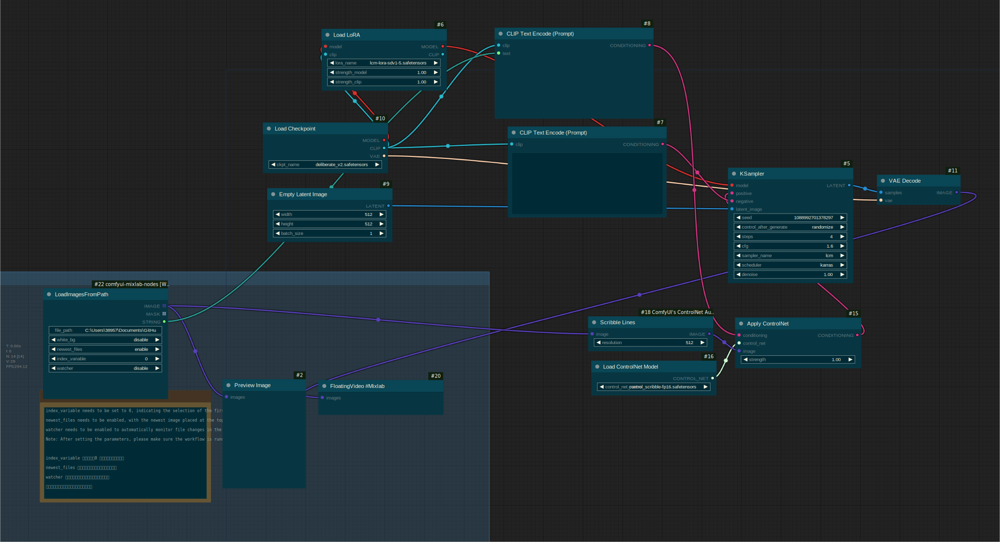

[workflow-4](./workflow/4-loadfromlocal-watcher-workflow.json)

#### LoadImagesFromURL

> Conveniently load images from a fixed address on the internet to ensure that default images in the workflow can be executed.

### Style

> Apply VisualStyle Prompting , Modified from [ComfyUI_VisualStylePrompting](https://github.com/ExponentialML/ComfyUI_VisualStylePrompting)

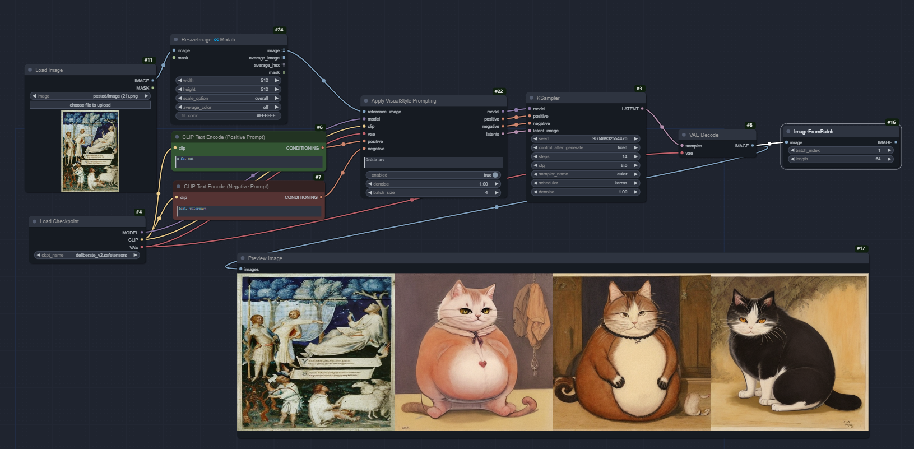

> StyleAligned , Modified from [style_aligned_comfy](https://github.com/brianfitzgerald/style_aligned_comfy)

### Utils

> The Color node provides a color picker for easy color selection, the Font node offers built-in font selection for use with TextImage to generate text images, and the DynamicDelayByText node allows delayed execution based on the length of the input text.

- [添加了 DynamicDelayByText 功能，可以根据输入文本的长度进行延迟执行。](./workflow/audio-chatgpt-workflow.json)

- [Added DynamicDelayByText, enabling delayed execution based on input text length.](./workflow/audio-chatgpt-workflow.json)

- [使用 CkptNames 对比不同的模型效果](./workflow/ckpts-image-workflow.json)

- [CkptNames compare the effects of different models.](./workflow/ckpts-image-workflow.json)

### Other Nodes


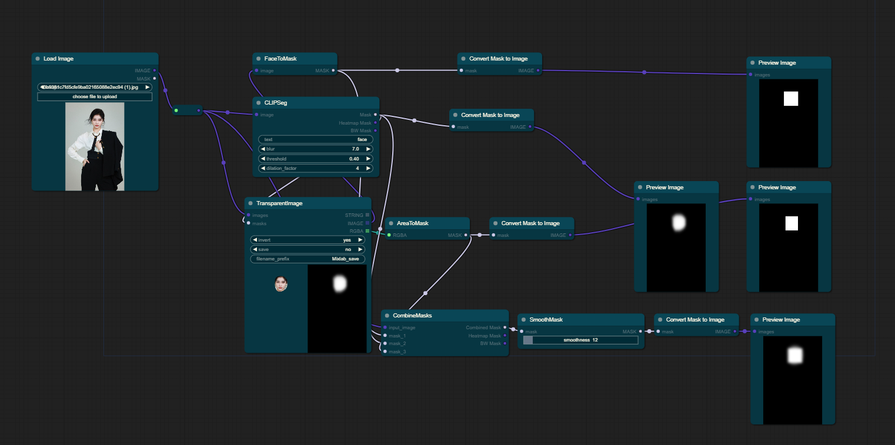

[workflow-1](./workflow/1-workflow.json)

> TransparentImage

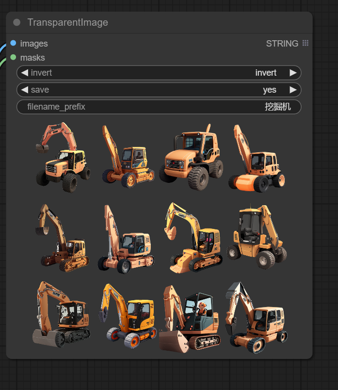

> FeatheredMask、SmoothMask

Add edges to an image.

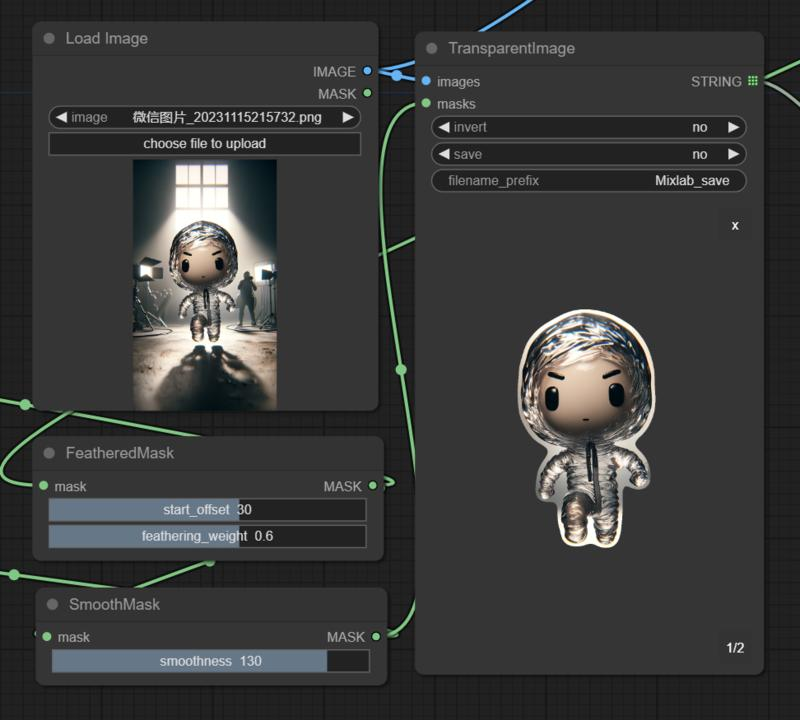

> LaMaInpainting

from [simple-lama-inpainting](https://github.com/enesmsahin/simple-lama-inpainting)

> rembgNode

"briarmbg","u2net","u2netp","u2net_human_seg","u2net_cloth_seg","silueta","isnet-general-use","isnet-anime"

**_ briarmbg _** model was developed by BRlA Al and can be used as an open-source model for non-commercial purposes

### Improvement

- Add "help" option to the context menu for each node.
- Add "Nodes Map" option to the global context menu.

An improvement has been made to directly redirect to GitHub to search for missing nodes when loading the graph.

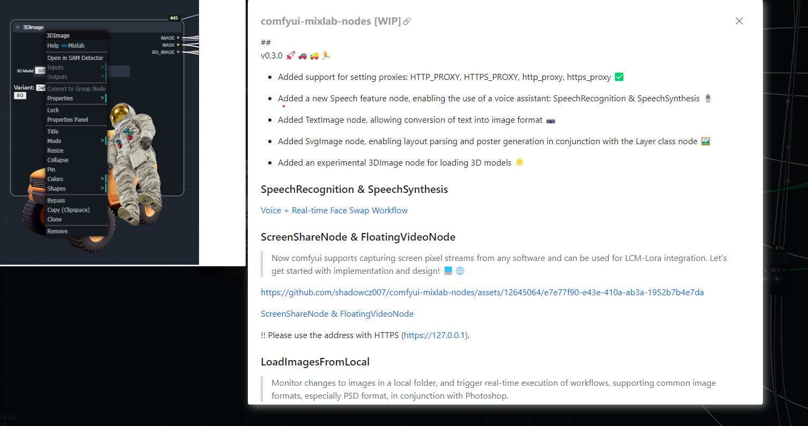

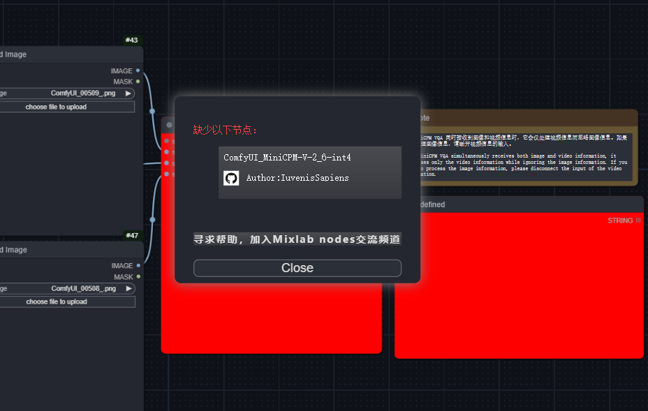

### Models

- [Download TripoSR](https://huggingface.co/stabilityai/TripoSR/blob/main/model.ckpt) and place it in `models/triposr`

- [Download facebook/dino-vitb16](https://huggingface.co/facebook/dino-vitb16/tree/main) and place it in `models/triposr/facebook/dino-vitb16`

[Download rembg Models](https://github.com/danielgatis/rembg/tree/main#Models),move to:`models/rembg`

[Download lama](https://github.com/enesmsahin/simple-lama-inpainting/releases/download/v0.1.0/big-lama.pt), move to : `models/lama`

[Download Salesforce/blip-image-captioning-base](https://huggingface.co/Salesforce/blip-image-captioning-base), move to :`models/clip_interrogator/Salesforce/blip-image-captioning-base`

[Download succinctly/text2image-prompt-generator](https://huggingface.co/succinctly/text2image-prompt-generator/tree/main),move to:`models/prompt_generator/text2image-prompt-generator`

[Download Helsinki-NLP/opus-mt-zh-en](https://huggingface.co/Helsinki-NLP/opus-mt-zh-en/tree/main),move to:`models/prompt_generator/opus-mt-zh-en`

## Installation

manually install, simply clone the repo into the custom_nodes directory with this command:

```
cd ComfyUI/custom_nodes

git clone https://github.com/shadowcz007/comfyui-mixlab-nodes.git

```

Install the requirements:

run directly:

```
cd ComfyUI/custom_nodes/comfyui-mixlab-nodes
install.bat
```

or install the requirements using:

```
../../../python_embeded/python.exe -s -m pip install -r requirements.txt
```

If you are using a venv, make sure you have it activated before installation and use:

```
pip3 install -r requirements.txt
```

#### Chinese community

访问 [www.mixcomfy.com](https://www.mixcomfy.com)，获得更多内测功能，关注微信公众号：Mixlab 无界社区

####

File / LoadImagesFromPath SaveImageToLocal LoadImagesFromURL

#### discussions:

[discussions](https://github.com/shadowcz007/comfyui-mixlab-nodes/discussions)

<picture>
  <source
    media="(prefers-color-scheme: dark)"
    srcset="
      https://api.star-history.com/svg?repos=shadowcz007/comfyui-mixlab-nodes&type=Date&theme=dark
    "
  />
  <source
    media="(prefers-color-scheme: light)"
    srcset="
      https://api.star-history.com/svg?repos=shadowcz007/comfyui-mixlab-nodes&type=Date
    "
  />
  
</picture>
